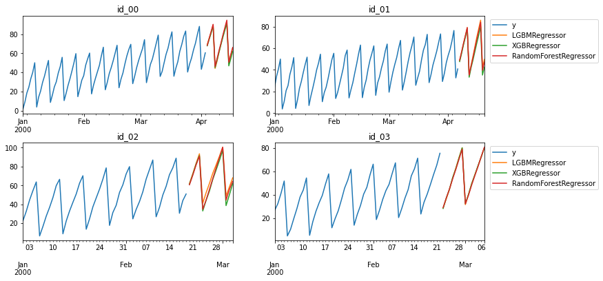

mlforecast
================

<!-- WARNING: THIS FILE WAS AUTOGENERATED! DO NOT EDIT! -->

[](https://github.com/Nixtla/mlforecast/actions/workflows/ci.yaml)
[](https://pypi.org/project/mlforecast/)
[](https://pypi.org/project/mlforecast/)
[](https://anaconda.org/conda-forge/mlforecast)
[](https://github.com/Nixtla/mlforecast/blob/main/LICENSE)

## Install

### PyPI

`pip install mlforecast`

If you want to perform distributed training, you can instead use
`pip install mlforecast[distributed]`, which will also install
[dask](https://dask.org/). Note that you’ll also need to install either
[LightGBM](https://github.com/microsoft/LightGBM/tree/master/python-package)
or
[XGBoost](https://xgboost.readthedocs.io/en/latest/install.html#python).

### conda-forge

`conda install -c conda-forge mlforecast`

Note that this installation comes with the required dependencies for the
local interface. If you want to perform distributed training, you must
install dask (`conda install -c conda-forge dask`) and either
[LightGBM](https://github.com/microsoft/LightGBM/tree/master/python-package)
or
[XGBoost](https://xgboost.readthedocs.io/en/latest/install.html#python).

## How to use

The following provides a very basic overview, for a more detailed
description see the
[documentation](https://nixtla.github.io/mlforecast/).

Store your time series in a pandas dataframe in long format, that is,
each row represents an observation for a specific serie and timestamp.

``` python
from mlforecast.utils import generate_daily_series

series = generate_daily_series(
    n_series=20,
    max_length=100,
    n_static_features=1,
    static_as_categorical=False,
    with_trend=True
)
series.head()
```

<div>
<table border="1" class="dataframe">
  <thead>
    <tr style="text-align: right;">
      <th></th>
      <th>ds</th>
      <th>y</th>
      <th>static_0</th>
    </tr>
    <tr>
      <th>unique_id</th>
      <th></th>
      <th></th>
      <th></th>
    </tr>
  </thead>
  <tbody>
    <tr>
      <th>id_00</th>
      <td>2000-01-01</td>
      <td>1.751917</td>
      <td>72</td>
    </tr>
    <tr>
      <th>id_00</th>
      <td>2000-01-02</td>
      <td>9.196715</td>
      <td>72</td>
    </tr>
    <tr>
      <th>id_00</th>
      <td>2000-01-03</td>
      <td>18.577788</td>
      <td>72</td>
    </tr>
    <tr>
      <th>id_00</th>
      <td>2000-01-04</td>
      <td>24.520646</td>
      <td>72</td>
    </tr>
    <tr>
      <th>id_00</th>
      <td>2000-01-05</td>
      <td>33.418028</td>
      <td>72</td>
    </tr>
  </tbody>
</table>
</div>

Next define your models. If you want to use the local interface this can
be any regressor that follows the scikit-learn API. For distributed
training there are `LGBMForecast` and `XGBForecast`.

``` python
import lightgbm as lgb
import xgboost as xgb
from sklearn.ensemble import RandomForestRegressor

models = [
    lgb.LGBMRegressor(),
    xgb.XGBRegressor(),
    RandomForestRegressor(random_state=0),
]
```

Now instantiate a `Forecast` object with the models and the features
that you want to use. The features can be lags, transformations on the
lags and date features. The lag transformations are defined as
[numba](http://numba.pydata.org/) *jitted* functions that transform an
array, if they have additional arguments you supply a tuple
(`transform_func`, `arg1`, `arg2`, …).

``` python
from mlforecast import Forecast
from window_ops.expanding import expanding_mean
from window_ops.rolling import rolling_mean

fcst = Forecast(
    models=models,
    freq='D',
    lags=[7, 14],
    lag_transforms={
        1: [expanding_mean],
        7: [(rolling_mean, 7)]
    },
    date_features=['dayofweek'],
    differences=[1],
)
```

To compute the features and train the models call `fit` on your
`Forecast` object. Here you have to specify the columns that:

- Identify each serie (`id_col`). If the series identifier is the index
  you can specify `id_col='index'`
- Contain the timestamps (`time_col`). Can also be integers if your data
  doesn’t have timestamps.
- Are the series values (`target_col`)

``` python
fcst.fit(series, id_col='index', time_col='ds', target_col='y', static_features=['static_0'])
```

    Forecast(models=[LGBMRegressor, XGBRegressor, RandomForestRegressor], freq=<Day>, lag_features=['lag-7', 'lag-14', 'expanding_mean_lag-1', 'rolling_mean_lag-7_window_size-7'], date_features=['dayofweek'], num_threads=1)

To get the forecasts for the next 14 days call `predict(14)` on the
forecast object. This will automatically handle the updates required by
the features using a recursive strategy.

``` python
predictions = fcst.predict(14)
```

``` python
import matplotlib.pyplot as plt
import pandas as pd

fig, ax = plt.subplots(nrows=2, ncols=2, figsize=(12, 6), gridspec_kw=dict(hspace=0.3))
for i, (cat, axi) in enumerate(zip(series.index.categories, ax.flat)):
    pd.concat([series.loc[cat, ['ds', 'y']], predictions.loc[cat]]).set_index('ds').plot(ax=axi)
    axi.set(title=cat, xlabel=None)
    if i % 2 == 0:
        axi.legend().remove()
    else:
        axi.legend(bbox_to_anchor=(1.01, 1.0))
fig.savefig('figs/index.png', bbox_inches='tight')
plt.close()
```


