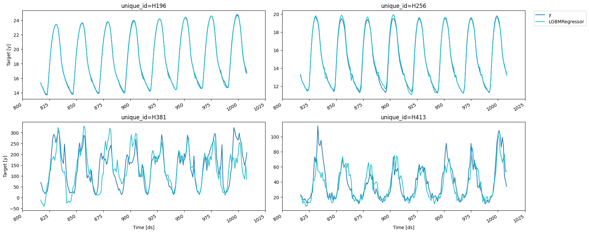
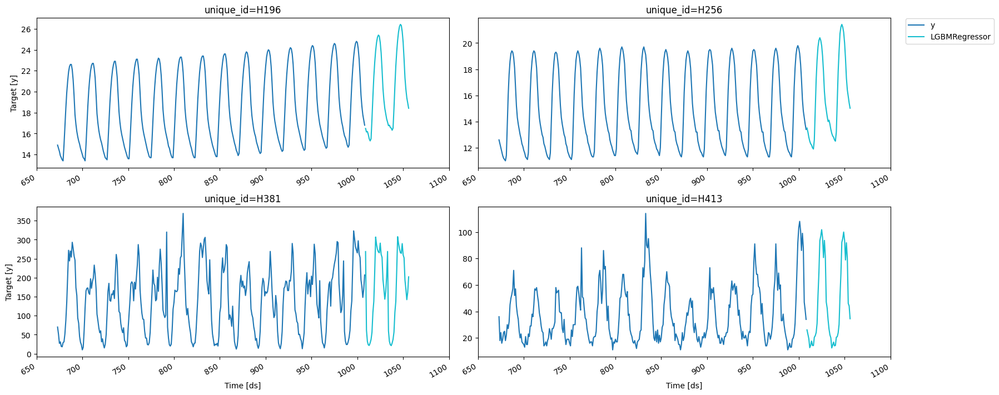

> Detailed description of all the functionalities that MLForecast
> provides.

## Data setup

For this example we’ll use a subset of the M4 hourly dataset. You can
find the a notebook with the full dataset
[here](https://www.kaggle.com/code/lemuz90/m4-competition).

```python
import random
import tempfile
from pathlib import Path

import pandas as pd
from datasetsforecast.m4 import M4
from utilsforecast.plotting import plot_series
```


```python
await M4.async_download('data', group='Hourly')
df, *_ = M4.load('data', 'Hourly')
uids = df['unique_id'].unique()
random.seed(0)
sample_uids = random.choices(uids, k=4)
df = df[df['unique_id'].isin(sample_uids)].reset_index(drop=True)
df['ds'] = df['ds'].astype('int64')
df
```

|      | unique_id | ds   | y    |
|------|-----------|------|------|
| 0    | H196      | 1    | 11.8 |
| 1    | H196      | 2    | 11.4 |
| 2    | H196      | 3    | 11.1 |
| 3    | H196      | 4    | 10.8 |
| 4    | H196      | 5    | 10.6 |
| ...  | ...       | ...  | ...  |
| 4027 | H413      | 1004 | 99.0 |
| 4028 | H413      | 1005 | 88.0 |
| 4029 | H413      | 1006 | 47.0 |
| 4030 | H413      | 1007 | 41.0 |
| 4031 | H413      | 1008 | 34.0 |

## EDA

We’ll take a look at our series to get ideas for transformations and
features.

```python
fig = plot_series(df, max_insample_length=24 * 14)
```


We can use the `MLForecast.preprocess` method to explore different
transformations. It looks like these series have a strong seasonality on
the hour of the day, so we can subtract the value from the same hour in
the previous day to remove it. This can be done with the
`mlforecast.target_transforms.Differences` transformer, which we pass
through `target_transforms`.

```python
from mlforecast import MLForecast
from mlforecast.target_transforms import Differences
```


```python
fcst = MLForecast(
    models=[],  # we're not interested in modeling yet
    freq=1,  # our series have integer timestamps, so we'll just add 1 in every timestep
    target_transforms=[Differences([24])],
)
prep = fcst.preprocess(df)
prep
```

|      | unique_id | ds   | y    |
|------|-----------|------|------|
| 24   | H196      | 25   | 0.3  |
| 25   | H196      | 26   | 0.3  |
| 26   | H196      | 27   | 0.1  |
| 27   | H196      | 28   | 0.2  |
| 28   | H196      | 29   | 0.2  |
| ...  | ...       | ...  | ...  |
| 4027 | H413      | 1004 | 39.0 |
| 4028 | H413      | 1005 | 55.0 |
| 4029 | H413      | 1006 | 14.0 |
| 4030 | H413      | 1007 | 3.0  |
| 4031 | H413      | 1008 | 4.0  |

This has subtracted the lag 24 from each value, we can see what our
series look like now.

```python
fig = plot_series(prep)
```


## Adding features

### Lags

Looks like the seasonality is gone, we can now try adding some lag
features.

```python
fcst = MLForecast(
    models=[],
    freq=1,
    lags=[1, 24],
    target_transforms=[Differences([24])],    
)
prep = fcst.preprocess(df)
prep
```

|      | unique_id | ds   | y    | lag1 | lag24 |
|------|-----------|------|------|------|-------|
| 48   | H196      | 49   | 0.1  | 0.1  | 0.3   |
| 49   | H196      | 50   | 0.1  | 0.1  | 0.3   |
| 50   | H196      | 51   | 0.2  | 0.1  | 0.1   |
| 51   | H196      | 52   | 0.1  | 0.2  | 0.2   |
| 52   | H196      | 53   | 0.1  | 0.1  | 0.2   |
| ...  | ...       | ...  | ...  | ...  | ...   |
| 4027 | H413      | 1004 | 39.0 | 29.0 | 1.0   |
| 4028 | H413      | 1005 | 55.0 | 39.0 | -25.0 |
| 4029 | H413      | 1006 | 14.0 | 55.0 | -20.0 |
| 4030 | H413      | 1007 | 3.0  | 14.0 | 0.0   |
| 4031 | H413      | 1008 | 4.0  | 3.0  | -16.0 |

```python
prep.drop(columns=['unique_id', 'ds']).corr()['y']
```

``` text
y        1.000000
lag1     0.622531
lag24   -0.234268
Name: y, dtype: float64
```

### Lag transforms

Lag transforms are defined as a dictionary where the keys are the lags
and the values are the transformations that we want to apply to that
lag. The lag transformations can be either objects from the
`mlforecast.lag_transforms` module or [numba](http://numba.pydata.org/)
jitted functions (so that computing the features doesn’t become a
bottleneck and we can bypass the GIL when using multithreading), we have
some implemented in the [window-ops
package](https://github.com/jmoralez/window_ops) but you can also
implement your own.

```python
from mlforecast.lag_transforms import ExpandingMean, RollingMean
```


```python
from numba import njit
from window_ops.rolling import rolling_mean
```


```python
@njit
def rolling_mean_48(x):
    return rolling_mean(x, window_size=48)


fcst = MLForecast(
    models=[],
    freq=1,
    target_transforms=[Differences([24])],    
    lag_transforms={
        1: [ExpandingMean()],
        24: [RollingMean(window_size=48), rolling_mean_48],
    },
)
prep = fcst.preprocess(df)
prep
```

|      | unique_id | ds   | y    | expanding_mean_lag1 | rolling_mean_lag24_window_size48 | rolling_mean_48_lag24 |
|------|-----------|------|------|---------------------|----------------------------------|-----------------------|
| 95   | H196      | 96   | 0.1  | 0.174648            | 0.150000                         | 0.150000              |
| 96   | H196      | 97   | 0.3  | 0.173611            | 0.145833                         | 0.145833              |
| 97   | H196      | 98   | 0.3  | 0.175342            | 0.141667                         | 0.141667              |
| 98   | H196      | 99   | 0.3  | 0.177027            | 0.141667                         | 0.141667              |
| 99   | H196      | 100  | 0.3  | 0.178667            | 0.141667                         | 0.141667              |
| ...  | ...       | ...  | ...  | ...                 | ...                              | ...                   |
| 4027 | H413      | 1004 | 39.0 | 0.242084            | 3.437500                         | 3.437500              |
| 4028 | H413      | 1005 | 55.0 | 0.281633            | 2.708333                         | 2.708333              |
| 4029 | H413      | 1006 | 14.0 | 0.337411            | 2.125000                         | 2.125000              |
| 4030 | H413      | 1007 | 3.0  | 0.351324            | 1.770833                         | 1.770833              |
| 4031 | H413      | 1008 | 4.0  | 0.354018            | 1.208333                         | 1.208333              |


You can see that both approaches get to the same result, you can use
whichever one you feel most comfortable with.

### Date features

If your time column is made of timestamps then it might make sense to
extract features like week, dayofweek, quarter, etc. You can do that by
passing a list of strings with [pandas time/date
components](https://pandas.pydata.org/docs/user_guide/timeseries.html#time-date-components).
You can also pass functions that will take the time column as input, as
we’ll show here.

```python
def hour_index(times):
    return times % 24

fcst = MLForecast(
    models=[],
    freq=1,
    target_transforms=[Differences([24])],
    date_features=[hour_index],
)
fcst.preprocess(df)
```

|      | unique_id | ds   | y    | hour_index |
|------|-----------|------|------|------------|
| 24   | H196      | 25   | 0.3  | 1          |
| 25   | H196      | 26   | 0.3  | 2          |
| 26   | H196      | 27   | 0.1  | 3          |
| 27   | H196      | 28   | 0.2  | 4          |
| 28   | H196      | 29   | 0.2  | 5          |
| ...  | ...       | ...  | ...  | ...        |
| 4027 | H413      | 1004 | 39.0 | 20         |
| 4028 | H413      | 1005 | 55.0 | 21         |
| 4029 | H413      | 1006 | 14.0 | 22         |
| 4030 | H413      | 1007 | 3.0  | 23         |
| 4031 | H413      | 1008 | 4.0  | 0          |

### Target transformations

If you want to do some transformation to your target before computing
the features and then re-apply it after predicting you can use the
`target_transforms` argument, which takes a list of transformations. You
can find the implemented ones in `mlforecast.target_transforms` or you
can implement your own as described in the [target transformations
guide](../how-to-guides/target_transforms_guide.html#custom-transformations).

```python
from mlforecast.target_transforms import LocalStandardScaler
```


```python
fcst = MLForecast(
    models=[],
    freq=1,
    lags=[1],
    target_transforms=[LocalStandardScaler()]
)
fcst.preprocess(df)
```

|      | unique_id | ds   | y         | lag1      |
|------|-----------|------|-----------|-----------|
| 1    | H196      | 2    | -1.493026 | -1.383286 |
| 2    | H196      | 3    | -1.575331 | -1.493026 |
| 3    | H196      | 4    | -1.657635 | -1.575331 |
| 4    | H196      | 5    | -1.712505 | -1.657635 |
| 5    | H196      | 6    | -1.794810 | -1.712505 |
| ...  | ...       | ...  | ...       | ...       |
| 4027 | H413      | 1004 | 3.062766  | 2.425012  |
| 4028 | H413      | 1005 | 2.523128  | 3.062766  |
| 4029 | H413      | 1006 | 0.511751  | 2.523128  |
| 4030 | H413      | 1007 | 0.217403  | 0.511751  |
| 4031 | H413      | 1008 | -0.126003 | 0.217403  |

We can define a naive model to test this

```python
from sklearn.base import BaseEstimator

class Naive(BaseEstimator):
    def fit(self, X, y):
        return self

    def predict(self, X):
        return X['lag1']
```


```python
fcst = MLForecast(
    models=[Naive()],
    freq=1,
    lags=[1],
    target_transforms=[LocalStandardScaler()]
)
fcst.fit(df)
preds = fcst.predict(1)
preds
```

|     | unique_id | ds   | Naive |
|-----|-----------|------|-------|
| 0   | H196      | 1009 | 16.8  |
| 1   | H256      | 1009 | 13.4  |
| 2   | H381      | 1009 | 207.0 |
| 3   | H413      | 1009 | 34.0  |

We compare this with the last values of our series

```python
last_vals = df.groupby('unique_id').tail(1)
last_vals
```

|      | unique_id | ds   | y     |
|------|-----------|------|-------|
| 1007 | H196      | 1008 | 16.8  |
| 2015 | H256      | 1008 | 13.4  |
| 3023 | H381      | 1008 | 207.0 |
| 4031 | H413      | 1008 | 34.0  |

```python
import numpy as np
```


```python
np.testing.assert_allclose(preds['Naive'], last_vals['y'])
```

## Training

Once you’ve decided the features, transformations and models that you
want to use you can use the `MLForecast.fit` method instead, which will
do the preprocessing and then train the models. The models can be
specified as a list (which will name them by using their class name and
an index if there are repeated classes) or as a dictionary where the
keys are the names you want to give to the models, i.e. the name of the
column that will hold their predictions, and the values are the models
themselves.

```python
import lightgbm as lgb
```


```python
lgb_params = {
    'verbosity': -1,
    'num_leaves': 512,
}

fcst = MLForecast(
    models={
        'avg': lgb.LGBMRegressor(**lgb_params),
        'q75': lgb.LGBMRegressor(**lgb_params, objective='quantile', alpha=0.75),
        'q25': lgb.LGBMRegressor(**lgb_params, objective='quantile', alpha=0.25),
    },
    freq=1,
    target_transforms=[Differences([24])],
    lags=[1, 24],
    lag_transforms={
        1: [ExpandingMean()],
        24: [RollingMean(window_size=48)],
    },
    date_features=[hour_index],
)
fcst.fit(df)
```

``` text
MLForecast(models=[avg, q75, q25], freq=1, lag_features=['lag1', 'lag24', 'expanding_mean_lag1', 'rolling_mean_lag24_window_size48'], date_features=[<function hour_index>], num_threads=1)
```

This computed the features and trained three different models using
them. We can now compute our forecasts.

## Forecasting

```python
preds = fcst.predict(48)
preds
```

|     | unique_id | ds   | avg        | q75        | q25       |
|-----|-----------|------|------------|------------|-----------|
| 0   | H196      | 1009 | 16.295257  | 16.357148  | 16.315731 |
| 1   | H196      | 1010 | 15.910282  | 16.007322  | 15.862261 |
| 2   | H196      | 1011 | 15.728367  | 15.780183  | 15.658180 |
| 3   | H196      | 1012 | 15.468414  | 15.513598  | 15.399717 |
| 4   | H196      | 1013 | 15.081279  | 15.133848  | 15.007694 |
| ... | ...       | ...  | ...        | ...        | ...       |
| 187 | H413      | 1052 | 100.450617 | 124.211150 | 47.025017 |
| 188 | H413      | 1053 | 88.426800  | 108.303409 | 44.715380 |
| 189 | H413      | 1054 | 59.675737  | 81.859964  | 19.239462 |
| 190 | H413      | 1055 | 57.580356  | 72.703301  | 21.486674 |
| 191 | H413      | 1056 | 42.669879  | 46.018271  | 24.392357 |

```python
fig = plot_series(df, preds, max_insample_length=24 * 7)
```


## Saving and loading

The MLForecast class has the `MLForecast.save` and `MLForecast.load` to
store and then load the forecast object.

```python
with tempfile.TemporaryDirectory() as tmpdir:
    save_dir = Path(tmpdir) / 'mlforecast'
    fcst.save(save_dir)
    fcst2 = MLForecast.load(save_dir)
    preds2 = fcst2.predict(48)
    pd.testing.assert_frame_equal(preds, preds2)
```

## Updating series’ values

After you’ve trained a forecast object you can save and load it with the
previous methods. If by the time you want to use it you already know the
following values of the target you can use the `MLForecast.update`
method to incorporate these, which will allow you to use these new
values when computing predictions.

-   If no new values are provided for a series that’s currently stored,
    only the previous ones are kept.
-   If new series are included they are added to the existing ones.

```python
fcst = MLForecast(
    models=[Naive()],
    freq=1,
    lags=[1, 2, 3],
)
fcst.fit(df)
fcst.predict(1)
```

|     | unique_id | ds   | Naive |
|-----|-----------|------|-------|
| 0   | H196      | 1009 | 16.8  |
| 1   | H256      | 1009 | 13.4  |
| 2   | H381      | 1009 | 207.0 |
| 3   | H413      | 1009 | 34.0  |

```python
new_values = pd.DataFrame({
    'unique_id': ['H196', 'H256'],
    'ds': [1009, 1009],
    'y': [17.0, 14.0],
})
fcst.update(new_values)
preds = fcst.predict(1)
preds
```

|     | unique_id | ds   | Naive |
|-----|-----------|------|-------|
| 0   | H196      | 1010 | 17.0  |
| 1   | H256      | 1010 | 14.0  |
| 2   | H381      | 1009 | 207.0 |
| 3   | H413      | 1009 | 34.0  |

## Estimating model performance

### Cross validation

In order to get an estimate of how well our model will be when
predicting future data we can perform cross validation, which consists
of training a few models independently on different subsets of the data,
using them to predict a validation set and measuring their performance.

Since our data depends on time, we make our splits by removing the last
portions of the series and using them as validation sets. This process
is implemented in `MLForecast.cross_validation`.

```python
fcst = MLForecast(
    models=lgb.LGBMRegressor(**lgb_params),
    freq=1,
    target_transforms=[Differences([24])],
    lags=[1, 24],
    lag_transforms={
        1: [ExpandingMean()],
        24: [RollingMean(window_size=48)],
    },
    date_features=[hour_index],
)
cv_result = fcst.cross_validation(
    df,
    n_windows=4,  # number of models to train/splits to perform
    h=48,  # length of the validation set in each window
)
cv_result
```

|     | unique_id | ds   | cutoff | y    | LGBMRegressor |
|-----|-----------|------|--------|------|---------------|
| 0   | H196      | 817  | 816    | 15.3 | 15.383165     |
| 1   | H196      | 818  | 816    | 14.9 | 14.923219     |
| 2   | H196      | 819  | 816    | 14.6 | 14.667834     |
| 3   | H196      | 820  | 816    | 14.2 | 14.275964     |
| 4   | H196      | 821  | 816    | 13.9 | 13.973491     |
| ... | ...       | ...  | ...    | ...  | ...           |
| 763 | H413      | 1004 | 960    | 99.0 | 65.644823     |
| 764 | H413      | 1005 | 960    | 88.0 | 71.717097     |
| 765 | H413      | 1006 | 960    | 47.0 | 76.704377     |
| 766 | H413      | 1007 | 960    | 41.0 | 53.446638     |
| 767 | H413      | 1008 | 960    | 34.0 | 54.902634     |

```python
fig = plot_series(forecasts_df=cv_result.drop(columns='cutoff'))
```



We can compute the RMSE on each split.

```python
from utilsforecast.losses import rmse
```


```python
def evaluate_cv(df):
    return rmse(df, models=['LGBMRegressor'], id_col='cutoff').set_index('cutoff')

split_rmse = evaluate_cv(cv_result)
split_rmse
```

|        | LGBMRegressor |
|--------|---------------|
| cutoff |               |
| 816    | 29.418172     |
| 864    | 34.257598     |
| 912    | 13.145763     |
| 960    | 35.066261     |

And the average RMSE across splits.

```python
split_rmse.mean()
```

``` text
LGBMRegressor    27.971949
dtype: float64
```

You can quickly try different features and evaluate them this way. We
can try removing the differencing and using an exponentially weighted
average of the lag 1 instead of the expanding mean.

```python
from mlforecast.lag_transforms import ExponentiallyWeightedMean
```


```python
fcst = MLForecast(
    models=lgb.LGBMRegressor(**lgb_params),
    freq=1,
    lags=[1, 24],
    lag_transforms={
        1: [ExponentiallyWeightedMean(alpha=0.5)],
        24: [RollingMean(window_size=48)],      
    },
    date_features=[hour_index],    
)
cv_result2 = fcst.cross_validation(
    df,
    n_windows=4,
    h=48,
)
evaluate_cv(cv_result2).mean()
```

``` text
LGBMRegressor    25.874439
dtype: float64
```

### LightGBMCV

In the same spirit of estimating our model’s performance, `LightGBMCV`
allows us to train a few
[LightGBM](https://github.com/microsoft/LightGBM) models on different
partitions of the data. The main differences with
`MLForecast.cross_validation` are:

-   It can only train LightGBM models.
-   It trains all models **simultaneously** and gives us per-iteration
    averages of the errors across the complete forecasting window, which
    allows us to find the best iteration.

```python
from mlforecast.lgb_cv import LightGBMCV
```


```python
cv = LightGBMCV(
    freq=1,
    target_transforms=[Differences([24])],
    lags=[1, 24],
    lag_transforms={
        1: [ExpandingMean()],
        24: [RollingMean(window_size=48)],
    },
    date_features=[hour_index],
    num_threads=2,
)
cv_hist = cv.fit(
    df,
    n_windows=4,
    h=48,
    params=lgb_params,
    eval_every=5,
    early_stopping_evals=5,    
    compute_cv_preds=True,
)
```

``` text
[5] mape: 0.158639
[10] mape: 0.163739
[15] mape: 0.161535
[20] mape: 0.169491
[25] mape: 0.163690
[30] mape: 0.164198
Early stopping at round 30
Using best iteration: 5
```

As you can see this gives us the error by iteration (controlled by the
`eval_every` argument) and performs early stopping (which can be
configured with `early_stopping_evals` and `early_stopping_pct`). If you
set `compute_cv_preds=True` the out-of-fold predictions are computed
using the best iteration found and are saved in the `cv_preds_`
attribute.

```python
cv.cv_preds_
```

|     | unique_id | ds   | y    | Booster   | window |
|-----|-----------|------|------|-----------|--------|
| 0   | H196      | 817  | 15.3 | 15.473182 | 0      |
| 1   | H196      | 818  | 14.9 | 15.038571 | 0      |
| 2   | H196      | 819  | 14.6 | 14.849409 | 0      |
| 3   | H196      | 820  | 14.2 | 14.448379 | 0      |
| 4   | H196      | 821  | 13.9 | 14.148379 | 0      |
| ... | ...       | ...  | ...  | ...       | ...    |
| 187 | H413      | 1004 | 99.0 | 61.425396 | 3      |
| 188 | H413      | 1005 | 88.0 | 62.886890 | 3      |
| 189 | H413      | 1006 | 47.0 | 57.886890 | 3      |
| 190 | H413      | 1007 | 41.0 | 38.849009 | 3      |
| 191 | H413      | 1008 | 34.0 | 44.720562 | 3      |

```python
fig = plot_series(forecasts_df=cv.cv_preds_.drop(columns='window'))
```


You can use this class to quickly try different configurations of
features and hyperparameters. Once you’ve found a combination that works
you can train a model with those features and hyperparameters on all the
data by creating an `MLForecast` object from the `LightGBMCV` one as
follows:

```python
final_fcst = MLForecast.from_cv(cv)
final_fcst.fit(df)
preds = final_fcst.predict(48)
fig = plot_series(df, preds, max_insample_length=24 * 14)
```



