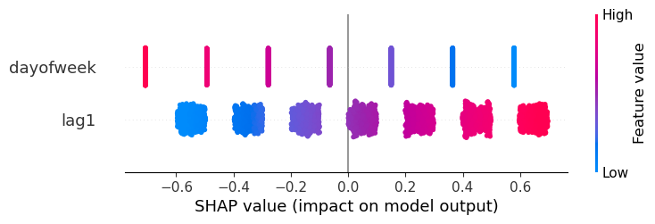
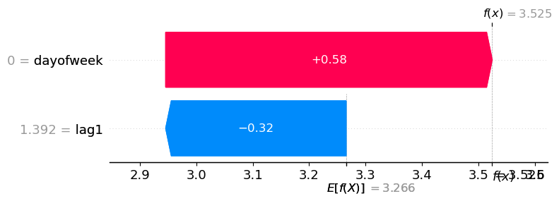

> Access and interpret the models after fitting

## Data setup

```python
from mlforecast.utils import generate_daily_series
```


```python
series = generate_daily_series(10)
series.head()
```

|     | unique_id | ds         | y        |
|-----|-----------|------------|----------|
| 0   | id_0      | 2000-01-01 | 0.322947 |
| 1   | id_0      | 2000-01-02 | 1.218794 |
| 2   | id_0      | 2000-01-03 | 2.445887 |
| 3   | id_0      | 2000-01-04 | 3.481831 |
| 4   | id_0      | 2000-01-05 | 4.191721 |

## Training

Suppose that you want to train a linear regression model using the day
of the week and lag1 as features.

```python
from sklearn.linear_model import LinearRegression

from mlforecast import MLForecast
```


```python
fcst = MLForecast(
    freq='D',
    models={'lr': LinearRegression()},
    lags=[1],
    date_features=['dayofweek'],
)
```


```python
fcst.fit(series)
```

``` text
MLForecast(models=[lr], freq=<Day>, lag_features=['lag1'], date_features=['dayofweek'], num_threads=1)
```

What `MLForecast.fit` does is save the required data for the predict
step and also train the models (in this case the linear regression). The
trained models are available in the `MLForecast.models_` attribute,
which is a dictionary where the keys are the model names and the values
are the model themselves.

```python
fcst.models_
```

``` text
{'lr': LinearRegression()}
```

## Inspect parameters

We can access the linear regression coefficients in the following way:

```python
fcst.models_['lr'].intercept_, fcst.models_['lr'].coef_
```

``` text
(3.2476337167384415, array([ 0.19896416, -0.21441331]))
```

## SHAP


```python
import shap
```


### Training set

If you need to generate the training data you can use
`MLForecast.preprocess`.

```python
prep = fcst.preprocess(series)
prep.head()
```

|     | unique_id | ds         | y        | lag1     | dayofweek |
|-----|-----------|------------|----------|----------|-----------|
| 1   | id_0      | 2000-01-02 | 1.218794 | 0.322947 | 6         |
| 2   | id_0      | 2000-01-03 | 2.445887 | 1.218794 | 0         |
| 3   | id_0      | 2000-01-04 | 3.481831 | 2.445887 | 1         |
| 4   | id_0      | 2000-01-05 | 4.191721 | 3.481831 | 2         |
| 5   | id_0      | 2000-01-06 | 5.395863 | 4.191721 | 3         |

We extract the X, which involves dropping the info columns (id + times)
and the target

```python
X = prep.drop(columns=['unique_id', 'ds', 'y'])
X.head()
```

|     | lag1     | dayofweek |
|-----|----------|-----------|
| 1   | 0.322947 | 6         |
| 2   | 1.218794 | 0         |
| 3   | 2.445887 | 1         |
| 4   | 3.481831 | 2         |
| 5   | 4.191721 | 3         |

We can now compute the shap values


```python
X100 = shap.utils.sample(X, 100)
explainer = shap.Explainer(fcst.models_['lr'].predict, X100)
shap_values = explainer(X)
```


And visualize them


```python
shap.plots.beeswarm(shap_values)
```




### Predictions

Sometimes you want to determine why the model gave a specific
prediction. In order to do this you need the input features, which
aren’t returned by default, but you can retrieve them using a callback.

```python
from mlforecast.callbacks import SaveFeatures
```


```python
save_feats = SaveFeatures()
preds = fcst.predict(1, before_predict_callback=save_feats)
preds.head()
```

|     | unique_id | ds         | lr       |
|-----|-----------|------------|----------|
| 0   | id_0      | 2000-08-10 | 3.468643 |
| 1   | id_1      | 2000-04-07 | 3.016877 |
| 2   | id_2      | 2000-06-16 | 2.815249 |
| 3   | id_3      | 2000-08-30 | 4.048894 |
| 4   | id_4      | 2001-01-08 | 3.524532 |

You can now retrieve the features by using `SaveFeatures.get_features`

```python
features = save_feats.get_features()
features.head()
```

|     | lag1     | dayofweek |
|-----|----------|-----------|
| 0   | 4.343744 | 3         |
| 1   | 3.150799 | 4         |
| 2   | 2.137412 | 4         |
| 3   | 6.182456 | 2         |
| 4   | 1.391698 | 0         |

And use those features to compute the shap values.


```python
shap_values_predictions = explainer(features)
```


We can now analyze what influenced the prediction for `'id_4'`.

```python
round(preds.loc[4, 'lr'], 3)
```

``` text
3.525
```


```python
shap.plots.waterfall(shap_values_predictions[4])
```




