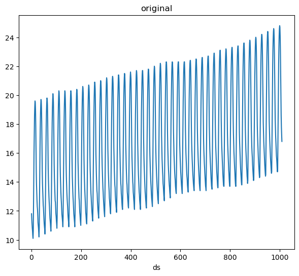
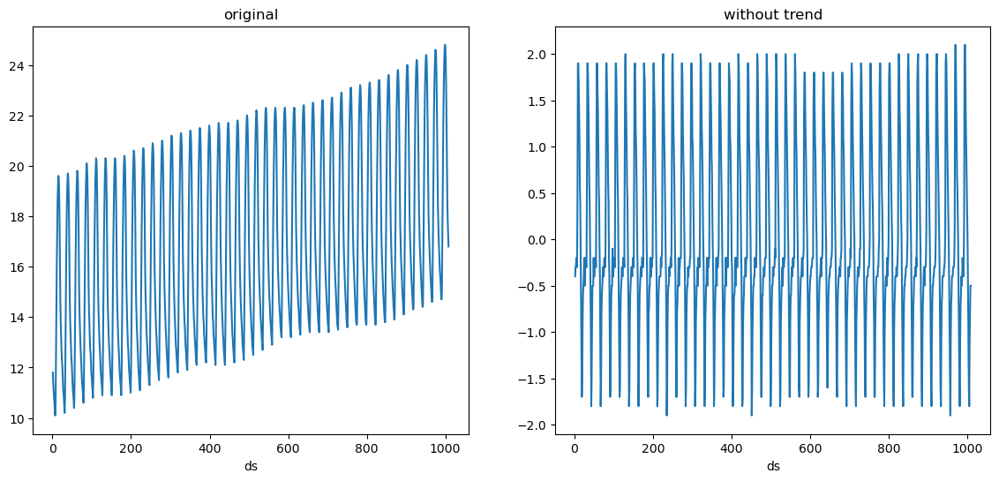
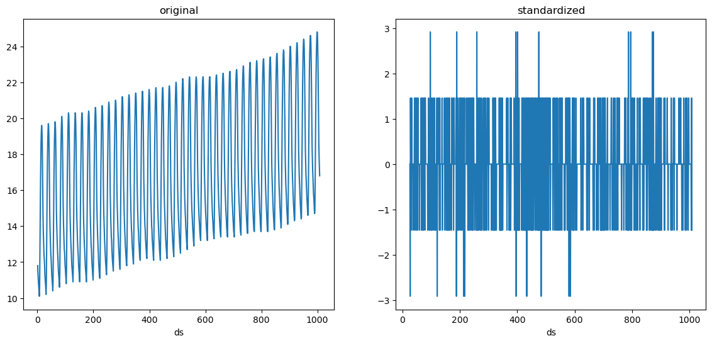
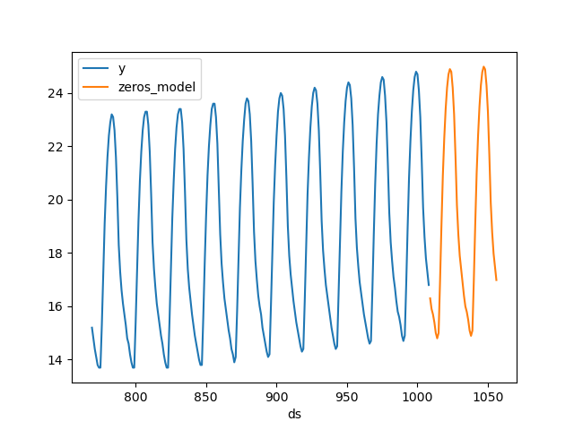
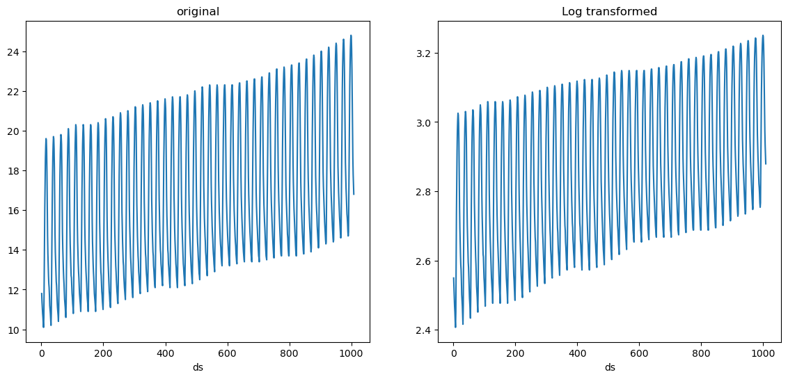
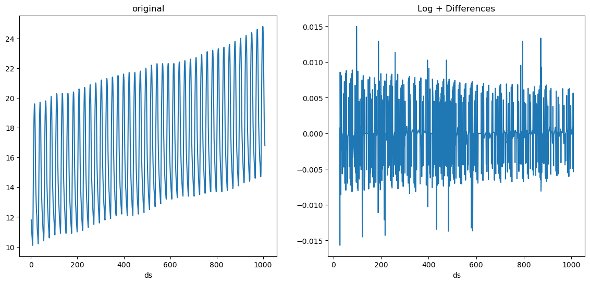
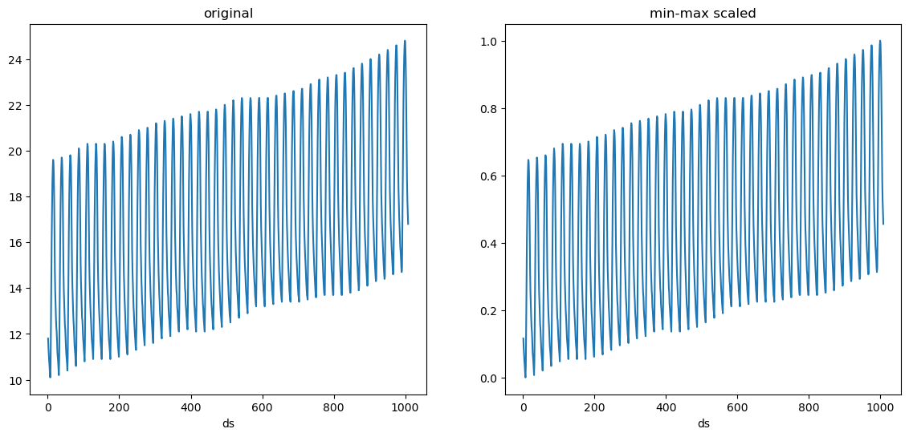

> Seamlessly transform target values

Since mlforecast uses a single global model it can be helpful to apply
some transformations to the target to ensure that all series have
similar distributions. They can also help remove trend for models that
can’t deal with it out of the box.

## Data setup

For this example we’ll use a single serie from the M4 dataset.

```python
import matplotlib.pyplot as plt
import numpy as np
import pandas as pd
from datasetsforecast.m4 import M4
from sklearn.base import BaseEstimator

from mlforecast import MLForecast
from mlforecast.target_transforms import Differences, LocalStandardScaler
```


```python
data_path = 'data'
await M4.async_download(data_path, group='Hourly')
df, *_ = M4.load(data_path, 'Hourly')
df['ds'] = df['ds'].astype('int32')
serie = df[df['unique_id'].eq('H196')]
```

## Local transformations

> Transformations applied per serie

### Differences

We’ll take a look at our serie to see possible differences that would
help our models.

```python
def plot(series, fname):
    n_series = len(series)
    fig, ax = plt.subplots(ncols=n_series, figsize=(7 * n_series, 6), squeeze=False)
    for (title, serie), axi in zip(series.items(), ax.flat):
        serie.set_index('ds')['y'].plot(title=title, ax=axi)
    fig.savefig(f'../../figs/{fname}', bbox_inches='tight')
    plt.close()
```


```python
plot({'original': serie}, 'target_transforms__eda.png')
```



We can see that our data has a trend as well as a clear seasonality. We
can try removing the trend first.

```python
fcst = MLForecast(
    models=[],
    freq=1,
    target_transforms=[Differences([1])],
)
without_trend = fcst.preprocess(serie)
plot({'original': serie, 'without trend': without_trend}, 'target_transforms__diff1.png')
```



The trend is gone, we can now try taking the 24 difference (subtract the
value at the same hour in the previous day).

```python
fcst = MLForecast(
    models=[],
    freq=1,
    target_transforms=[Differences([1, 24])],
)
without_trend_and_seasonality = fcst.preprocess(serie)
plot({'original': serie, 'without trend and seasonality': without_trend_and_seasonality}, 'target_transforms__diff2.png')
```


### LocalStandardScaler

We see that our serie is random noise now. Suppose we also want to
standardize it, i.e. make it have a mean of 0 and variance of 1. We can
add the LocalStandardScaler transformation after these differences.

```python
fcst = MLForecast(
    models=[],
    freq=1,
    target_transforms=[Differences([1, 24]), LocalStandardScaler()],
)
standardized = fcst.preprocess(serie)
plot({'original': serie, 'standardized': standardized}, 'target_transforms__standardized.png')
standardized['y'].agg(['mean', 'var']).round(2)
```

``` text
mean   -0.0
var     1.0
Name: y, dtype: float64
```



Now that we’ve captured the components of the serie (trend +
seasonality), we could try forecasting it with a model that always
predicts 0, which will basically project the trend and seasonality.

```python
class Zeros(BaseEstimator):
    def fit(self, X, y=None):
        return self

    def predict(self, X, y=None):
        return np.zeros(X.shape[0])

fcst = MLForecast(
    models={'zeros_model': Zeros()},
    freq=1,
    target_transforms=[Differences([1, 24]), LocalStandardScaler()],
)
preds = fcst.fit(serie).predict(48)
fig, ax = plt.subplots()
pd.concat([serie.tail(24 * 10), preds]).set_index('ds').plot(ax=ax)
plt.close()
```



## Global transformations

> Transformations applied to all series

### GlobalSklearnTransformer

There are some transformations that don’t require to learn any
parameters, such as applying logarithm for example. These can be easily
defined using the `GlobalSklearnTransformer`, which takes a scikit-learn
compatible transformer and applies it to all series. Here’s an example
on how to define a transformation that applies logarithm to each value
of the series + 1, which can help avoid computing the log of 0.

```python
import numpy as np
from sklearn.preprocessing import FunctionTransformer

from mlforecast.target_transforms import GlobalSklearnTransformer

sk_log1p = FunctionTransformer(func=np.log1p, inverse_func=np.expm1)
fcst = MLForecast(
    models={'zeros_model': Zeros()},
    freq=1,
    target_transforms=[GlobalSklearnTransformer(sk_log1p)],
)
log1p_transformed = fcst.preprocess(serie)
plot({'original': serie, 'Log transformed': log1p_transformed}, 'target_transforms__log.png')
```



We can also combine this with local transformations. For example we can
apply log first and then differencing.

```python
fcst = MLForecast(
    models=[],
    freq=1,
    target_transforms=[GlobalSklearnTransformer(sk_log1p), Differences([1, 24])],
)
log_diffs = fcst.preprocess(serie)
plot({'original': serie, 'Log + Differences': log_diffs}, 'target_transforms__log_diffs.png')
```



## Custom transformations

> Implementing your own target transformations

In order to implement your own target transformation you have to define
a class that inherits from
`mlforecast.target_transforms.BaseTargetTransform` (this takes care of
setting the column names as the `id_col`, `time_col` and `target_col`
attributes) and implement the `fit_transform` and `inverse_transform`
methods. Here’s an example on how to define a min-max scaler.

```python
from mlforecast.target_transforms import BaseTargetTransform
```


```python
class LocalMinMaxScaler(BaseTargetTransform):
    """Scales each serie to be in the [0, 1] interval."""
    def fit_transform(self, df: pd.DataFrame) -> pd.DataFrame:
        self.stats_ = df.groupby(self.id_col)[self.target_col].agg(['min', 'max'])
        df = df.merge(self.stats_, on=self.id_col)
        df[self.target_col] = (df[self.target_col] - df['min']) / (df['max'] - df['min'])
        df = df.drop(columns=['min', 'max'])
        return df

    def inverse_transform(self, df: pd.DataFrame) -> pd.DataFrame:
        df = df.merge(self.stats_, on=self.id_col)
        for col in df.columns.drop([self.id_col, self.time_col, 'min', 'max']):
            df[col] = df[col] * (df['max'] - df['min']) + df['min']
        df = df.drop(columns=['min', 'max'])
        return df
```

And now you can pass an instance of this class to the
`target_transforms` argument.

```python
fcst = MLForecast(
    models=[],
    freq=1,
    target_transforms=[LocalMinMaxScaler()],
)
minmax_scaled = fcst.preprocess(serie)
plot({'original': serie, 'min-max scaled': minmax_scaled}, 'target_transforms__minmax.png')
```



