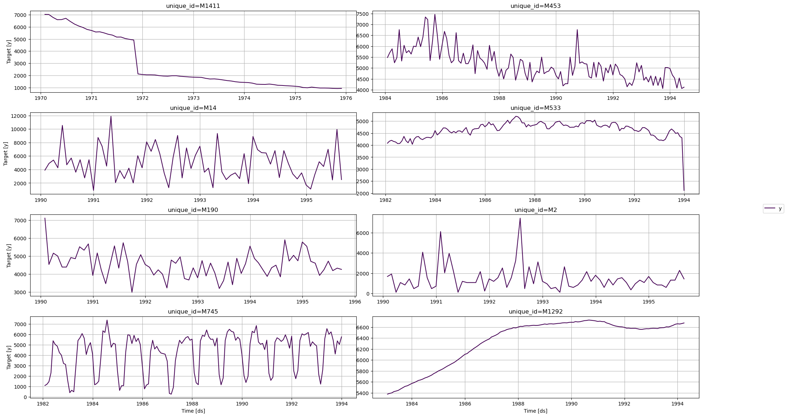
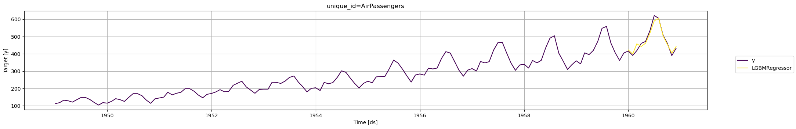

Transfer learning refers to the process of pre-training a flexible model
on a large dataset and using it later on other data with little to no
training. It is one of the most outstanding 🚀 achievements in Machine
Learning and has many practical applications.

For time series forecasting, the technique allows you to get
lightning-fast predictions ⚡ bypassing the tradeoff between accuracy
and speed (more than 30 times faster than our already fast
[AutoARIMA](https://github.com/Nixtla/statsforecast) for a similar
accuracy).

This notebook shows how to generate a pre-trained model to forecast new
time series never seen by the model.

Table of Contents

-   Installing MLForecast
-   Load M3 Monthly Data
-   Instantiate NeuralForecast core, Fit, and save
-   Use the pre-trained model to predict on AirPassengers
-   Evaluate Results

You can run these experiments with Google Colab.

<a href="https://colab.research.google.com/github/Nixtla/mlforecast/blob/main/nbs/docs/transfer_learning.ipynb" target="_parent"></a>

## Installing Libraries

```python
%%capture
# !pip install mlforecast datasetsforecast utilsforecast s3fs
```


```python
import lightgbm as lgb
import numpy as np
import pandas as pd
from datasetsforecast.m3 import M3
from sklearn.metrics import mean_absolute_error
from utilsforecast.plotting import plot_series

from mlforecast import MLForecast
from mlforecast.target_transforms import Differences
```

## Load M3 Data

The `M3` class will automatically download the complete M3 dataset and
process it.

It return three Dataframes: `Y_df` contains the values for the target
variables, `X_df` contains exogenous calendar features and `S_df`
contains static features for each time-series. For this example we will
only use `Y_df`.

If you want to use your own data just replace `Y_df`. Be sure to use a
long format and have a similar structure than our data set.

```python
Y_df_M3, _, _ = M3.load(directory='./', group='Monthly')
```

In this tutorial we are only using `1_000` series to speed up
computations. Remove the filter to use the whole dataset.

```python
fig = plot_series(Y_df_M3)
```



## Model Training

Using the `MLForecast.fit` method you can train a set of models to your
dataset. You can modify the hyperparameters of the model to get a better
accuracy, in this case we will use the default hyperparameters of
`lgb.LGBMRegressor`.

```python
models = [lgb.LGBMRegressor(verbosity=-1)]
```

The `MLForecast` object has the following parameters:

-   `models`: a list of sklearn-like (`fit` and `predict`) models.
-   `freq`: a string indicating the frequency of the data. See [panda’s
    available
    frequencies.](https://pandas.pydata.org/pandas-docs/stable/user_guide/timeseries.html#offset-aliases)
-   `differences`: Differences to take of the target before computing
    the features. These are restored at the forecasting step.
-   `lags`: Lags of the target to use as features.

In this example, we are only using `differences` and `lags` to produce
features. See [the full
documentation](https://nixtlaverse.nixtla.io/mlforecast/forecast) to see
all available features.

Any settings are passed into the constructor. Then you call its `fit`
method and pass in the historical data frame `Y_df_M3`.

```python
fcst = MLForecast(
    models=models,
    lags=range(1, 13),
    freq='MS',
    target_transforms=[Differences([1, 12])],
)
fcst.fit(Y_df_M3);
```

## Transfer M3 to AirPassengers

Now we can transfer the trained model to forecast `AirPassengers` with
the `MLForecast.predict` method, we just have to pass the new dataframe
to the `new_data` argument.

```python
Y_df = pd.read_csv('https://datasets-nixtla.s3.amazonaws.com/air-passengers.csv', parse_dates=['ds'])

# We define the train df.
Y_train_df = Y_df[Y_df.ds<='1959-12-31'] # 132 train
Y_test_df = Y_df[Y_df.ds>'1959-12-31']   # 12 test
```


```python
Y_hat_df = fcst.predict(h=12, new_df=Y_train_df)
Y_hat_df.head()
```

|     | unique_id     | ds         | LGBMRegressor |
|-----|---------------|------------|---------------|
| 0   | AirPassengers | 1960-01-01 | 422.740096    |
| 1   | AirPassengers | 1960-02-01 | 399.480193    |
| 2   | AirPassengers | 1960-03-01 | 458.220289    |
| 3   | AirPassengers | 1960-04-01 | 442.960385    |
| 4   | AirPassengers | 1960-05-01 | 461.700482    |

```python
Y_hat_df = Y_test_df.merge(Y_hat_df, how='left', on=['unique_id', 'ds'])
```


```python
fig = plot_series(Y_train_df, Y_hat_df)
```



## Evaluate Results

We evaluate the forecasts of the pre-trained model with the Mean
Absolute Error (`mae`).

$$
\qquad MAE = \frac{1}{Horizon} \sum_{\tau} |y_{\tau} - \hat{y}_{\tau}|\qquad
$$

```python
y_true = Y_test_df.y.values
y_hat = Y_hat_df['LGBMRegressor'].values
```


```python
print(f'LGBMRegressor     MAE: {mean_absolute_error(y_hat, y_true):.3f}')
print('ETS               MAE: 16.222')
print('AutoARIMA         MAE: 18.551')
```

``` text
LGBMRegressor     MAE: 13.560
ETS               MAE: 16.222
AutoARIMA         MAE: 18.551
```

