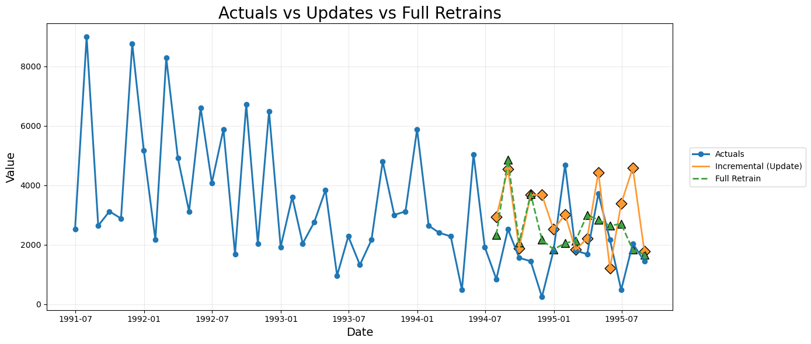

This tutorial provides a practical framework for developing
**incremental forecasting systems** using Nixtla’s `MLForecast`. It
walks through the full process of building scalable time series
pipelines-from baseline model training to monthly incremental
updates-illustrating how `update()` enables efficient, real-time
forecast refreshes without full retraining. The focus is on designing
**sustainable, production-grade forecasting workflows** that balance
speed, adaptability, and long-term accuracy.

## **Table of Contents**

1.  Introduction
2.  Why Incremental Forecasting Matters
3.  Why You Should Not Retrain at Every Step
4.  When Full Retraining Becomes Necessary
5.  A Hybrid Cadence for Reliable Forecasting Pipelines  
6.  Model Design and Implementation Flow
7.  Comparing Incremental Updates and Full Retraining
8.  Visual Analysis of Forecast Behavior
9.  Conclusion

## **Introduction**

When a forecasting system goes live, the flow of data doesn’t stop. Each
month - or even each week - new observations arrive, and decision-makers
expect your forecasts to adjust in real time. Yet, retraining the entire
model every time new data comes in, is often the default reaction. It
seems simple, but it’s computationally expensive, time-consuming, and
can introduce instability into production workflows.

This is where incremental forecasting becomes essential. Instead of
retraining from scratch, we can incrementally update the model to
reflect the latest data while preserving its learned patterns and
parameters. In Nixtla’s `MLForecast`, the `update()` method provides
this capability by allowing a trained forecasting object to absorb new
observations without retraining the underlying estimator. It extends the
historical window for each series, recalculates lag and date features,
and ensures that subsequent forecasts are generated using the most
recent actuals.

## **Why You Shouldn’t Retrain Every Time**

Once your forecasting system is operational, new data becomes a
constant. Each cycle - be it daily, weekly, or monthly - brings new
observations that reflect the latest market conditions. The instinctive
reaction is to retrain the entire model whenever new data arrives, under
the assumption that a fresh model guarantees higher accuracy. In
practice, however, **frequent retraining is neither efficient nor
necessary**.

Retraining a global model across thousands of time series is
computationally expensive and can introduce instability into production
pipelines. Each retrain recalculates lag features, re-splits data,
re-fits hyperparameters, and may slightly shift model weights due to
stochastic effects, creating subtle variations in forecast outputs that
can confuse downstream systems or decision-makers. Moreover, most new
observations tend to reinforce existing patterns rather than alter them
drastically.

The **incremental update** approach offers a more robust alternative.
Instead of discarding the existing model, MLForecast’s `update()` method
allows you to append new observations to the existing historical window.
It recalculates lag, lag_transforms, and date features while keeping the
learned model parameters fixed. This ensures that your forecasts stay
aligned with the most recent actuals without triggering a full
retraining cycle. The table below summarizes the difference between
Retraining the model and Incremental Learning.

| **Concern**             | **Retraining Every Month**                                         | **Using `update()` (Incremental Learning)**                              |
|------------|------------------------------|------------------------------|
| **Compute Cost**        | High (retraining models for all SKUs consumes significant compute) | Minimal (only updates incremental weights or new samples)                |
| **Speed**               | Slow (full retraining can take hours for large datasets)           | Fast (updates often complete in seconds or minutes, even for many SKUs)  |
| **Model Stability**     | May introduce noise or instability between training runs           | Maintains consistent learned structure; less susceptible to random noise |
| **Versioning Overhead** | Multiple model artifacts; difficult to track and manage            | Single stable model with incremental updates; simpler to manage          |
| **Operational Risk**    | Errors can propagate during frequent retraining cycles             | Controlled, gradual updates reduce sudden failures                       |

## **When to Retrain Anyway**

Incremental updates are powerful, but they are not a permanent
substitute for model retraining. Over time, even the most robust
forecasting systems experience **concept drift** - subtle or abrupt
changes in the underlying data-generating process. When this happens,
the relationships your model once learned no longer represent reality.
In other words, the past stops being a reliable guide to the future.

Retraining becomes necessary when the environment changes in ways that
cannot be captured by simply appending new observations. Some common
triggers include:

#### 1. Structural breaks in the data

Events such as product rebranding, changes in packaging, or shifts in
demand patterns can cause discontinuities in historical trends. These
“structural breaks” disrupt the temporal consistency that incremental
updates rely on. A retraining cycle helps the model recalibrate to the
new baseline.

**How to identify structural changes**

| Method Category                                 | Technique                                        | How it Works                                                                                                                                                     | When to Use                                                                                                                             |
|----------------------|---------------|-------------------|-----------------|
| **Classical structural break detection**        | CUSUM, Bai Perron tests, Chow test               | Detects statistically significant breaks in mean, variance, trend, or regression relationships by comparing parameter stability across segments                  | When regime changes are suspected due to events such as rebranding, packaging changes, policy interventions, or known breakpoint shifts |
| **Residual and error diagnostics**              | Residual pattern analysis, rolling RMSE or RMSSE | Identifies abrupt structural changes by detecting persistent bias, variance jumps, new autocorrelation patterns, or sudden degradation in performance metrics    | When the model begins underpredicting or overpredicting in a consistent pattern or when accuracy drops after a structural shift         |
| **Machine learning based structural detection** | Drift classification models                      | Uses classification to distinguish between pre-event and post-event data, revealing multidimensional structural differences                                      | When breaks are subtle, involve multiple features, or are not well captured by classical statistical tests                              |
| **Domain driven indicators**                    | Business event logs, operational change tracking | Links structural changes to real business events such as assortment updates, supply chain disruptions, pricing regime shifts, or major operational interventions | When the structural break is caused by an external or managerial action rather than intrinsic time-series behaviour                     |

#### 2. Distributional or Seasonal Drift

If the statistical properties of the series - mean, variance, or
seasonal amplitudes - start deviating consistently from past patterns,
your lag-based features become less predictive.

**How to identify distributional or seasonal drift**

| Method Category                            | Technique                                                                                                          | What it Detects                                                                                                    | When to Use                                                                                 |
|---------------------|--------------|----------------------|----------------|
| **Distributional drift detection**         | KS test, PSI, Jensen Shannon divergence, KL divergence                                                             | Detects shifts in mean, variance, shape, or overall distribution differences between historical and recent windows | When monitoring for gradual distributional drift in production systems                      |
| **Residual and error diagnostics**         | Rolling RMSSE, windowed performance metrics, residual distribution comparison                                      | Detects sustained performance degradation or changes in residual bias, variance, or autocorrelation                | When accuracy declines or residual patterns indicate emerging drift                         |
| **Seasonality drift detection**            | STL or MSTL seasonal comparison, seasonal correlation checks, spectral density analysis, seasonal strength metrics | Detects changes in seasonal amplitude, timing, periodicity, or variance explained by seasonality                   | When intra year seasonality evolves due to behavior, climate, or market changes             |
| **Machine learning based drift detection** | Drift classification model                                                                                         | Detects subtle or multidimensional drift by classifying old vs new windows                                         | When drift affects multiple features simultaneously and is not captured by univariate tests |

#### 3. Changes in Exogenous Features

When the relationship between the target and external drivers changes,
the model’s learned dependencies no longer reflect how the real world
behaves. These changes often arise from broader business or
environmental shifts rather than from the time series itself. For
example, sudden changes in import tariffs can make certain products more
expensive and reduce sensitivity to discounts, altering long-standing
price–demand relationships. The COVID-19 pandemic is another well known
example where mobility restrictions, work-from-home adoption, and shifts
in consumer priorities changed the way promotions, holidays, and even
weather patterns influenced demand. Fuel price spikes can change
commuting behaviour and affect categories like ready-to-eat foods,
travel accessories, or home improvement. Unexpected supply shortages can
change how customers respond to stockouts or substitute products. Even
store refurbishments, new competitor entries, or changes in brand
positioning can shift the effectiveness of promotions or alter the
response to price changes. In all these scenarios, the external features
have not simply drifted in value; the way they influence demand has
changed. Models relying on outdated relationships need retraining to
correctly learn the new dependency structure.

#### 4. Model degradation in Monitoring Metrics

A steady rise in forecast error such as RMSSE or MAPE across a
meaningful portion of the portfolio is one of the clearest signals that
incremental updates are no longer sufficient. In practice, this
degradation is detected through rolling or windowed error tracking,
residual stability checks, horizon specific error monitoring, and cohort
level breakdowns, all of which were discussed in earlier sections. When
these monitoring signals begin to trend upward consistently, or when
residuals show persistent bias or variance inflation, it indicates that
the model is drifting away from the underlying data generating process.
At this point, incremental updates can no longer correct the
misalignment and a full retraining cycle becomes necessary to restore
performance stability.

#### 5. Major Business or Market Shifts

Major business or market shifts can reshape demand patterns so abruptly
that previously learned temporal relationships no longer hold. External
shocks such as sudden supply chain disruptions, unexpected policy
changes, or rapid demand surges create new regimes that the model has
never seen before. Examples include widespread stockouts during global
logistics delays, regulatory changes affecting product availability, or
short-term spikes in demand triggered by festivals, weather anomalies,
or viral social trends. As discussed earlier, these shifts often operate
outside the time series itself and override the stability that
incremental updates rely on. When such events realign consumer behaviour
or operational constraints, a full retraining cycle becomes necessary to
ensure the model adapts to the new environment.

## **A Hybrid Cadence for Sustainable Forecasting**

Retraining and updating are not competing strategies - they’re
complementary. In a well-engineered forecasting pipeline, the two work
together to balance **adaptability**, **efficiency**, and **stability**.
This balanced cadence ensures your model evolves with data drift while
avoiding unnecessary computational overhead.

A **hybrid cadence** combines three operational layers:

#### 1. Routine Incremental Updates (Short-Term Adaptation)

Use MLForecast’s `update()` method every time new data arrives -
typically weekly or monthly. This keeps forecasts current by
recalculating lag and date features using the latest observations,
without retraining the model.

-   **Objective:** Maintain freshness of forecasts
-   **Cost:** Minimal (light computation)
-   **When to use:** After each data ingestion cycle

#### 2. Scheduled Retraining (Periodic Refresh)

Perform full model retraining at regular intervals - for instance,
quarterly or semi-annually. This refreshes feature relationships,
captures gradual drift, and resets model parameters to reflect long-term
trends.

-   **Objective:** Recalibrate the model to evolving seasonal or macro
    patterns
-   **Cost:** Moderate to high (training time and resource usage)
-   **When to use:** On a fixed calendar schedule or after major
    seasonal transitions

#### 3. Drift-Triggered Retraining (Event-Based Correction)

Deploy monitoring scripts that track forecast accuracy (e.g., RMSSE,
MAPE, WAPE) and detect statistical drift using tools such as the
Kolmogorov–Smirnov test or rolling error windows. If accuracy degrades
beyond a defined threshold, initiate an unscheduled retrain.

-   **Objective:** Respond to sudden or unanticipated changes
-   **Cost:** High but justified by regained accuracy
-   **When to use:** When metrics indicate model degradation or feature
    distribution shifts

#### Quantitative Validation

To evaluate the effectiveness of this cadence, compare update-only
vs. retrain strategies using MLForecast’s `cross_validation()`:

-   `refit=False` simulates incremental updates (trained once, updated
    continuously)
-   `refit=True` simulates retraining at each historical window If
    `refit=True` consistently outperforms `refit=False`, it signals that
    drift is significant and retraining yields real gains.

#### Why This Matters

This cadence matters because forecasting systems fail silently when they
rely on only one mechanism of adaptation. Incremental updates alone
cannot correct for long-term drift, and full retraining alone cannot
deliver the responsiveness modern pipelines require. By combining both,
you create a system that stays fresh in the short term, stable in the
long term, and resilient when unexpected changes occur. It ensures that
the model not only keeps pace with new data but also remains aligned
with the deeper structural patterns that drive forecasting accuracy. In
practice this means fewer operational surprises, fewer degradations that
go unnoticed, and forecasts that remain dependable even as the business
and the environment around it evolve.

In essence, **incremental updates keep your model agile; retraining
keeps it honest.**

## **Code Implementation Overview**

#### **Installing `mlforecast` and Required Libraries**

Before we dive into incremental forecasting, let’s set up the
environment by installing all necessary dependencies. We’ll use
**Nixtla’s `mlforecast`**, along with common Python libraries for data
handling and visualization. You can open it in colab in this
[link](https://colab.research.google.com/github/Nixtla/mlforecast/blob/main/nbs/docs/tutorials/incremental_forecasting.ipynb).

> 💡 *Tip:* If you’re running this in Google Colab or a fresh
> environment, it’s a good idea to restart the kernel after installation
> to ensure all dependencies are properly loaded.

```python
!pip install mlforecast datasetsforecast s3fs xgboost -q
```


```python
import warnings
warnings.filterwarnings("ignore")
```


```python
import xgboost as xgb
import pandas as pd
from mlforecast import MLForecast
from datasetsforecast.m3 import M3
import pandas as pd
import seaborn as sns
import matplotlib.pyplot as plt
from mlforecast.lag_transforms import (ExpandingMean, ExpandingStd, ExpandingMin, ExpandingMax, 
                                       RollingMean, RollingStd, RollingMin, RollingMax,ExponentiallyWeightedMean)
from functools import partial
import utilsforecast.losses as ufl
from utilsforecast.evaluation import evaluate
```

## **Loading the M3 Dataset**

For this demonstration, we’ll use the **M3 forecasting competition
dataset**, a widely used benchmark for evaluating time series models.  
Specifically, we’ll focus on the **`M1` series** from the **Monthly (M)
group**.

The M3 dataset provides multiple time series across different
frequencies -*Yearly, Quarterly, Monthly, and Others*.  
By selecting one unique identifier (`unique_id = 'M1'`), we can
visualize and test how incremental forecasting behaves on a single,
interpretable time series.

> 📘 *Note:* The dataset is loaded using Nixtla’s `datasetsforecast`
> package, which automatically structures the data in the expected
> format for MLForecast - columns `unique_id`, `ds` (date), and `y`
> (target value).

```python
# Load M3 data (e.g., monthly frequency)
Y_df, X_df, S_df = M3.load(directory='./', group='Monthly')

# Filter for the specified unique_id
select = ['M1']
df_select = Y_df[Y_df['unique_id'].isin(select)].copy()


# Convert 'Date' column to datetime in the original filtered dataframe
df_select['ds'] = pd.to_datetime(df_select['ds'])

# Sort by unique_id and Date to ensure correct slicing
df_select = df_select.sort_values(by=['unique_id', 'ds']).reset_index(drop=True)

print("Preview of df_select")
print("Top 5 rows:")
display(df_select.head())

print("\nShape of df_select")
print(f"Rows: {df_select.shape[0]}")
print(f"Columns: {df_select.shape[1]}")
```

``` text
Preview of df_select
Top 5 rows:

Shape of df_select
Rows: 68
Columns: 3
```

|     | unique_id | ds         | y      |
|-----|-----------|------------|--------|
| 0   | M1        | 1990-01-31 | 2640.0 |
| 1   | M1        | 1990-02-28 | 2640.0 |
| 2   | M1        | 1990-03-31 | 2160.0 |
| 3   | M1        | 1990-04-30 | 4200.0 |
| 4   | M1        | 1990-05-31 | 3360.0 |

#### **Defining the Simulation Scenario**

To replicate a **real-world production forecasting setup**, we’ll
simulate how forecasts evolve as new data arrives over time, without
retraining the model. This helps us understand how Nixtla’s `update()`
method can efficiently keep forecasts current in a live environment.

Here’s how we’ll structure the simulation:

-   Data **from 1991-06-30 to 1994-05-31** serves as the **baseline
    training period (Month 0)** - the last available data before the
    model is deployed.
-   We then simulate **three consecutive production updates**, where new
    observations gradually arrive:
    -   **Month 1:** Includes actuals for *1994-06-30*  
    -   **Month 2:** Includes actuals for *1994-07-31*  
    -   **Month 3:** Includes actuals for *1994-08-31*

At each step, the model will be **incrementally updated** using the
`update()` method, allowing it to absorb new observations, recompute
lags and date features, and produce refreshed forecasts without
undergoing a full retraining cycle.

```python

# Select the last 51 data points from df_select
data = df_select.tail(51)

# From these 51 points:
# - Use the first 36 data points for initial model training (Month 0)
# - Reserve the next 3 data points as sequential "new data arrivals"
train_month_zero = data.head(36)
new_data_all = data.iloc[36:39]


# Split the 3 new months into separate DataFrames to simulate data arriving one month at a time
new_data_month_one   = new_data_all.iloc[0:1]
new_data_month_two   = new_data_all.iloc[1:2]
new_data_month_three = new_data_all.iloc[2:3]


# Show the original training and new-data splits
print("Preview - Train DataFrame (Month 0 - initial training window):")
display(train_month_zero.head(5))

print("="*60)
print("\nNew Data Month One (to arrive after Month 0):")
display(new_data_month_one)


# Construct cumulative training sets by concatenation for showing the full training example
# - train_month_one  = train_month_zero  + new_data_month_one
# - train_month_two  = train_month_one   + new_data_month_two
# - train_month_three= train_month_two   + new_data_month_three
# We concatenate in chronological order so time index remains increasing.

train_month_one    = pd.concat([train_month_zero, new_data_month_one], ignore_index=True)
train_month_two    = pd.concat([train_month_one,  new_data_month_two], ignore_index=True)
train_month_three  = pd.concat([train_month_two,  new_data_month_three], ignore_index=True)

print("="*60)
print("\nPreview - train_month_one (last rows):")
display(train_month_one.tail(5))


# Create rolling test windows for evaluation
test_month_zero  = data.iloc[36:48]
test_month_one   = data.iloc[37:49]
test_month_two   = data.iloc[38:50]
test_month_three = data.iloc[39:51]


# Also display the test windows used for evaluation (as before)
print("="*60)
print("\nPreview - Test Window - Month 0 (after initial training):")
display(test_month_zero.head(5))


```

``` text
Preview - Train DataFrame (Month 0 - initial training window):
============================================================

New Data Month One (to arrive after Month 0):
============================================================

Preview - train_month_one (last rows):
============================================================

Preview - Test Window - Month 0 (after initial training):
```

|     | unique_id | ds         | y      |
|-----|-----------|------------|--------|
| 17  | M1        | 1991-06-30 | 2520.0 |
| 18  | M1        | 1991-07-31 | 9000.0 |
| 19  | M1        | 1991-08-31 | 2640.0 |
| 20  | M1        | 1991-09-30 | 3120.0 |
| 21  | M1        | 1991-10-31 | 2880.0 |

|     | unique_id | ds         | y      |
|-----|-----------|------------|--------|
| 53  | M1        | 1994-06-30 | 1920.0 |

|     | unique_id | ds         | y      |
|-----|-----------|------------|--------|
| 32  | M1        | 1994-02-28 | 2400.0 |
| 33  | M1        | 1994-03-31 | 2280.0 |
| 34  | M1        | 1994-04-30 | 480.0  |
| 35  | M1        | 1994-05-31 | 5040.0 |
| 36  | M1        | 1994-06-30 | 1920.0 |

|     | unique_id | ds         | y      |
|-----|-----------|------------|--------|
| 53  | M1        | 1994-06-30 | 1920.0 |
| 54  | M1        | 1994-07-31 | 840.0  |
| 55  | M1        | 1994-08-31 | 2520.0 |
| 56  | M1        | 1994-09-30 | 1560.0 |
| 57  | M1        | 1994-10-31 | 1440.0 |

#### **Model specification - XGBoost with lags and lag_transforms**

For this demonstration we use XGBoost Regressor together with a small
set of lag features and lag_transforms. The goal is to keep the model
simple and interpretable while preserving enough temporal information to
produce reliable incremental forecasts. In the next block we define the
complete forecasting setup for Month Zero. We create an MLForecast
object that includes the XGBoost Regressor, the time frequency of the
series and a structured set of lag features and lag based statistical
transforms. The same block also defines a compact evaluation function
that uses `utilsforecast` to merge predictions with the test set and
compute **MAE** and **RMSE**. This keeps the evaluation process
consistent for all forecasting stages that follow.

```python
# Load your data (must have columns: unique_id, ds, y)
df = train_month_zero

# Initialize the MLForecast object with model, frequency and feature settings
fcst = MLForecast(
    models=xgb.XGBRegressor(verbosity=0, random_state=5),
    freq='ME',
    lags=[1, 2, 3, 4, 6, 12],  # added more lags
    lag_transforms={
        1: [ExpandingMean(), ExpandingStd(), ExpandingMin(), ExpandingMax(), ExponentiallyWeightedMean(alpha=0.3)],
        3: [RollingMean(window_size=3),RollingMean(window_size=3),RollingStd(window_size=3)],
        6: [RollingMean(window_size=3),RollingMin(window_size=3),RollingMax(window_size=3)]
        },
    date_features=['month', 'quarter', 'year', 'week'])

# Fit the model using the Month Zero training data
fcst.fit(df)

# At this stage, forecasts are produced using data available up to Month 0.
predictions_month_zero = fcst.predict(h=12)

# Function for Evaluation using MAE and RMSE
def evaluate_forecast(test_month, predictions, train_data):
    """
    Wrapper function to evaluate forecasts using MAE and RMSE
    """
    result = evaluate(test_month.merge(predictions), metrics=[ufl.mae, ufl.rmse], train_df=train_data)
    return result
evaluation_month_zero = evaluate_forecast(test_month_zero, predictions_month_zero, train_month_zero)
```

### **Incremental Learning for Month 1, 2 and 3**

#### Updating the Model for Month One

Now that we have the actuals for **Month One (June 1994)**, we’ll
simulate how a forecasting system incorporates this new data without
retraining.

Instead of rebuilding the model from scratch, we’ll use the `update()`
method to **incrementally refresh** the forecasting object.  
This operation allows the model to:

-   Absorb the latest observation into its internal history  
-   Recompute lag and date-based features  
-   Generate forecasts that reflect the most recent trend

Importantly, the underlying model parameters remain fixed, we are simply
extending the historical window that the model bases its predictions on.
This is the essence of *incremental forecasting*: fast, efficient, and
adaptive to streaming data.

```python
# Update the trained model with the latest observation
fcst.update(new_data_month_one)

# Produce a new 12-month-ahead forecast using the extended data window.
predictions_month_one = fcst.predict(h=12)

# Evaluation at Incremental Month One
evaluation_incremental_month_one = evaluate_forecast(test_month_one, predictions_month_one, train_month_one)
```

#### Updating the Model for Month Two

Next, we simulate the arrival of **Month Two (July 1994)** data. By this
point, our model has already been incrementally updated with the June
actuals. Now, we extend the historical window once more by incorporating
the July observation.

```python
# Update the forecasting object with the July 1995 data
fcst.update(new_data_month_two)

# Generate new forecasts (12 months ahead) after Month Two update
predictions_month_two = fcst.predict(h=12)

# Evaluation at Incremental Month Two
evaluation_incremental_month_two = evaluate_forecast(test_month_two, predictions_month_two, train_month_two)
```

#### Updating the Model for Month Three

Finally, we simulate the arrival of **Month Three (August 1994)**
actuals. By this stage, the model has already incorporated data from
June and July through successive incremental updates. Now, we’ll perform
one more `update()` to include the August observation.

```python
# Update the model with Month Three data
fcst.update(new_data_month_three)

# Generate forecasts after Month Three update
predictions_month_three = fcst.predict(h=12)

# Evaluation at Incremental Month Three
evaluation_incremental_month_three = evaluate_forecast(test_month_three, predictions_month_three, train_month_three)
```

### **Full Retrain for Month 1, 2 and 3**

The following function reconstructs the entire MLForecast pipeline and
trains a fresh model on the supplied dataset. It defines a new XGBoost
regressor, rebuilds all lag features, regenerates lag based statistical
transforms and recreates the date features for every retraining cycle.

This function is used when we want to evaluate how the model performs
with full retraining after Month 1, Month 2 and Month 3.

```python
def run_mlforecast_model(input_df, forecast_name, horizon=12):
    """
    Trains a fresh MLForecast model on the given dataset and generates a new forecast for the specified horizon. 
    Used during full retraining steps to compare model performance across expanded training windows.
    """
    fcst = MLForecast(
        models=xgb.XGBRegressor(verbosity=0, random_state=5),
        freq='ME',
        lags=[1, 2, 3, 4, 6, 12],  # added more lags
        lag_transforms={
            1: [ExpandingMean(), ExpandingStd(), ExpandingMin(), ExpandingMax(), ExponentiallyWeightedMean(alpha=0.3)],
            3: [RollingMean(window_size=3),RollingMean(window_size=3),RollingStd(window_size=3)],
            6: [RollingMean(window_size=3),RollingMin(window_size=3),RollingMax(window_size=3)]
            },
        date_features=['month', 'quarter', 'year', 'week'],     
        )
    
    # Fit the newly constructed model on the provided training window
    fcst.fit(input_df)

    # Produce the forecast for the specified horizon
    predictions = fcst.predict(h=horizon)

    return predictions
```

#### Full retrain for Month One

```python
full_retrain_one = run_mlforecast_model(train_month_one, forecast_name = "full_retrain_one", horizon=12)
evaluation_fr_month_one = evaluate_forecast(test_month_one, full_retrain_one, train_month_one)
```

#### Full retrain for Month Two

```python
full_retrain_two = run_mlforecast_model(train_month_two, forecast_name = "full_retrain_two", horizon=12)
evaluation_fr_month_two = evaluate_forecast(test_month_two, full_retrain_two, train_month_two)
```

#### Full retrain for Month Three

```python
full_retrain_three = run_mlforecast_model(train_month_three, forecast_name = "full_retrain_three", horizon=12)
evaluation_fr_month_three = evaluate_forecast(test_month_three, full_retrain_three, train_month_three)
```

## **Displaying the Forecast for incremental updates and full retraining**

```python
# Prepare Actuals Data
actuals = data.rename(columns={'y': 'Actuals'})

# Prepare Prediction Dataframes
predictions_M0 = predictions_month_zero.rename(columns={'XGBRegressor': 'M0_fcst'})
predictions_M1 = predictions_month_one.rename(columns={'XGBRegressor': 'update_M1_fcst'})
predictions_M2 = predictions_month_two.rename(columns={'XGBRegressor': 'update_M2_fcst'})
predictions_M3 = predictions_month_three.rename(columns={'XGBRegressor': 'update_M3_fcst'})
full_retrain_M1 = full_retrain_one.rename(columns={'XGBRegressor': 'fr_M1_fcst'})
full_retrain_M2 = full_retrain_two.rename(columns={'XGBRegressor': 'fr_M2_fcst'})
full_retrain_M3 = full_retrain_three.rename(columns={'XGBRegressor': 'fr_M3_fcst'})

# Merge Dataframes horizontally
merged_df = actuals
prediction_dfs = [predictions_M0,predictions_M1, predictions_M2, predictions_M3, full_retrain_M1, full_retrain_M2, full_retrain_M3]

for pred_df in prediction_dfs:
    merged_df = pd.merge(merged_df,pred_df, on=['unique_id', 'ds'], how='outer')

print("Forecasts for the data:")
merged_df.tail(15)
```

``` text
Forecasts for the data:
```

|     | unique_id | ds         | Actuals | M0_fcst     | update_M1_fcst | update_M2_fcst | update_M3_fcst | fr_M1_fcst  | fr_M2_fcst  | fr_M3_fcst  |
|-----|-----------|------------|---------|-------------|----------------|----------------|----------------|-------------|-------------|-------------|
| 36  | M1        | 1994-06-30 | 1920.0  | 3864.938232 | NaN            | NaN            | NaN            | NaN         | NaN         | NaN         |
| 37  | M1        | 1994-07-31 | 840.0   | 2594.932129 | 2935.675293    | NaN            | NaN            | 2326.694824 | NaN         | NaN         |
| 38  | M1        | 1994-08-31 | 2520.0  | 4164.596680 | 4542.910156    | 4541.260742    | NaN            | 3381.296875 | 4850.554199 | NaN         |
| 39  | M1        | 1994-09-30 | 1560.0  | 1275.051147 | 1397.846802    | 1955.686035    | 1878.714355    | 1786.434082 | 2493.714600 | 2078.830322 |
| 40  | M1        | 1994-10-31 | 1440.0  | 1587.772827 | 2979.571533    | 3855.898438    | 3675.791504    | 2989.618164 | 3918.535889 | 3702.415039 |
| 41  | M1        | 1994-11-30 | 240.0   | 3405.029053 | 1300.912109    | 4274.687988    | 3670.577393    | 2768.753418 | 4103.104492 | 2165.639160 |
| 42  | M1        | 1994-12-31 | 1800.0  | 1239.843140 | 1272.664429    | 2168.222412    | 2514.473389    | 923.883606  | 2992.595947 | 1841.551758 |
| 43  | M1        | 1995-01-31 | 4680.0  | 2959.135498 | 3896.721191    | 2978.796875    | 3009.882568    | 2853.434082 | 1643.795288 | 2048.090332 |
| 44  | M1        | 1995-02-28 | 1800.0  | 3824.433594 | 2101.060303    | 1859.390747    | 1828.250122    | 1785.165283 | 1919.282837 | 2137.860596 |
| 45  | M1        | 1995-03-31 | 1680.0  | 2100.476807 | 2890.057617    | 2211.707520    | 2211.707520    | 2805.169922 | 2153.157715 | 3000.055664 |
| 46  | M1        | 1995-04-30 | 3720.0  | 3765.023926 | 4625.206543    | 4431.138184    | 4431.138184    | 4142.056152 | 550.080627  | 2833.239746 |
| 47  | M1        | 1995-05-31 | 2160.0  | 994.927246  | 1047.208374    | 1171.909912    | 1204.782959    | 1166.692383 | 4042.854492 | 2641.430664 |
| 48  | M1        | 1995-06-30 | 480.0   | NaN         | 3646.509521    | 3382.160645    | 3382.160645    | 3694.346191 | 2470.466553 | 2698.386230 |
| 49  | M1        | 1995-07-31 | 2040.0  | NaN         | NaN            | 4582.800781    | 4582.800781    | NaN         | 2140.027588 | 1828.845093 |
| 50  | M1        | 1995-08-31 | 1440.0  | NaN         | NaN            | NaN            | 1782.028687    | NaN         | NaN         | 1667.283569 |

## **MAE and RMSE comparison across Incremental Updates and Full Retraining**

The table below compares the MAE and RMSE produced by the incremental
forecasting approach and the full retraining approach for Month One,
Month Two and Month Three. This comparison helps illustrate how forecast
accuracy changes when the model is updated versus fully retrained on
expanded training windows.

```python
# Map each DF pair to the month name
mapping = {
    "Month One": (evaluation_incremental_month_one, evaluation_fr_month_one),
    "Month Two": (evaluation_incremental_month_two, evaluation_fr_month_two),
    "Month Three": (evaluation_incremental_month_three, evaluation_fr_month_three),
}

#Generate final dataframe
final_df = pd.DataFrame([{
    "unique_id": inc.loc[0, "unique_id"],
    "Month": m,
    "Incremental Model_MAE": inc.loc[inc.metric == "mae", inc.columns[-1]].item(),
    "Full Retrain Model_MAE": fr.loc[fr.metric == "mae", fr.columns[-1]].item(),
    "Incremental Model_RMSE": inc.loc[inc.metric == "rmse", inc.columns[-1]].item(),
    "Full Retrain Model_RMSE": fr.loc[fr.metric == "rmse", fr.columns[-1]].item(),
} for m, (inc, fr) in mapping.items()]).round(4)

print("Evaluation Metrics for the Data:")
display(final_df)

```

``` text
Evaluation Metrics for the Data:
```

|     | unique_id | Month       | Incremental Model_MAE | Full Retrain Model_MAE | Incremental Model_RMSE | Full Retrain Model_RMSE |
|-----|-----------|-------------|-----------------------|------------------------|------------------------|-------------------------|
| 0   | M1        | Month One   | 1240.6219             | 1260.4329              | 1487.0861              | 1545.5916               |
| 1   | M1        | Month Two   | 1556.0206             | 1797.5349              | 1958.8191              | 2156.6650               |
| 2   | M1        | Month Three | 1365.2481             | 1088.6065              | 1752.9972              | 1411.7591               |

## **Visualizing Actuals and Forecasts for Incremental Updates and Full Retraining**

To understand how the forecasting behavior evolves over time, we now
visualize the actual series together with the forecasted values
generated at each stage for both incremental updates and full
retraining. This includes predictions from Month 0, Month 1, Month 2 and
Month 3 for both approaches.

```python

# COLORS & MARKERS
COLOR_ACTUAL, COLOR_UPDATE, COLOR_RETRAIN = "#1f77b4", "#FF9933", "#40A240"
MARK_UPDATE, MARK_RETRAIN = "D", "^"


# HELPERS

def norm(df, name):
    """Rename the last prediction column to name and keep (unique_id, ds)."""
    col = [c for c in df.columns if c not in ["unique_id","ds","y"]][-1]
    return df.rename(columns={col:name})[["unique_id","ds",name]]

def _norm_out(df, out_col):
    """Normalize forecast df by renaming its last prediction column to out_col."""
    if df is None or df.empty: return None
    nd = norm(df, out_col); nd["ds"] = pd.to_datetime(nd["ds"]); return nd

def build_series(srcs, out_col):
    """Stitch multiple forecast runs, keeping the latest prediction for each ds."""
    parts = [ _norm_out(df, out_col) for df in srcs if _norm_out(df, out_col) is not None ]
    if not parts: return None
    df = pd.concat(parts, ignore_index=True)
    return (df.query("unique_id == @UNIQUE_ID")[["ds", out_col]]
            .sort_values("ds").drop_duplicates("ds", keep="last").reset_index(drop=True))

def extract_step(df, label, typ):
    """Extract the first available forecast point for marker plotting."""
    if df is None or df.empty: return None
    col = [c for c in df.columns if c not in ["unique_id","ds","y"]][-1]
    d = df[["ds", col]].rename(columns={col:label}); d["ds"] = pd.to_datetime(d["ds"]); d["type"] = typ; return d


# BUILD FORECASTS
UNIQUE_ID = "M1"

inc_df  = build_series([predictions_month_one.head(1), predictions_month_two.head(1), predictions_month_three], "Incremental")
full_df = build_series([full_retrain_one.head(1), full_retrain_two.head(1), full_retrain_three], "FullRetrain")

# Step markers
update_steps  = [extract_step(predictions_month_one.head(1),"Incremental","update"),
                 extract_step(predictions_month_two.head(1),"Incremental","update"),
                 extract_step(predictions_month_three,"Incremental","update")]
retrain_steps = [extract_step(full_retrain_one.head(1),"FullRetrain","retrain"),
                 extract_step(full_retrain_two.head(1),"FullRetrain","retrain"),
                 extract_step(full_retrain_three,"FullRetrain","retrain")]

update_steps, retrain_steps = [x for x in update_steps if x is not None], [x for x in retrain_steps if x is not None]


# ACTUALS
actuals = (data.query("unique_id == @UNIQUE_ID")[["ds","y"]]
           .rename(columns={"y":"Actual"})
           .assign(ds=lambda x: pd.to_datetime(x["ds"]))
           .sort_values("ds").reset_index(drop=True))


# MERGE
plot_df = actuals.copy()
if inc_df is not None:  plot_df = plot_df.merge(inc_df,  on="ds", how="outer")
if full_df is not None: plot_df = plot_df.merge(full_df, on="ds", how="outer")
plot_df = plot_df.sort_values("ds").reset_index(drop=True)


# PLOT
plt.figure(figsize=(14,6))

plt.plot(plot_df["ds"], plot_df["Actual"], color=COLOR_ACTUAL, lw=2.2,
         marker='o', markersize=6, markerfacecolor=COLOR_ACTUAL, markeredgecolor=COLOR_ACTUAL, label="Actuals")

if "Incremental" in plot_df:
    plt.plot(plot_df["ds"], plot_df["Incremental"], color=COLOR_UPDATE, lw=2.0, label="Incremental (Update)")

if "FullRetrain" in plot_df:
    plt.plot(plot_df["ds"], plot_df["FullRetrain"], color=COLOR_RETRAIN, lw=2.0, ls="--", label="Full Retrain")

for s in update_steps:
    plt.scatter(s["ds"], s["Incremental"], color=COLOR_UPDATE, marker=MARK_UPDATE,
                s=90, edgecolor="black", label=None)

for s in retrain_steps:
    plt.scatter(s["ds"], s["FullRetrain"], color=COLOR_RETRAIN, marker=MARK_RETRAIN,
                s=100, edgecolor="black", label=None)

plt.title("Actuals vs Updates vs Full Retrains", fontsize=20)
plt.grid(alpha=0.25)
plt.xlabel("Date", fontsize=14); plt.ylabel("Value", fontsize=14)
plt.legend(loc="center left", bbox_to_anchor=(1.02,0.5))
plt.tight_layout(); plt.show()

```



## **Comparative analysis of Incremental Updates and Full Retraining**

The plots and RMSE comparison table together provide a complete picture
of how the two forecasting strategies behave as new data becomes
available. Both methods process the same series, but their update
mechanisms differ. Incremental forecasting updates only the data window
while preserving the learned model parameters. Full retraining rebuilds
the entire model on each expanded dataset. The following points
summarise the observed behaviour.

#### 1. **Responsiveness to new observations**

-   Incremental updates shift the forecasts quickly toward the newest
    actual points. This is visible in the plot where each successive
    update pulls the forecast curves closer to the recent downward and
    upward movements in Month 1, 2 and 3.
-   Full retraining is also responsive, but sometimes overshoots or
    undershoots depending on how the newly retrained model interprets
    the expanded historical window. The variance introduced in the
    retrained curves is visible in the colour coded lines for
    FullRetrain M1, M2 and M3.

#### 2. **Stability and continuity of the forecast path**

-   The incremental method produces smoother transitions, since the
    model parameters do not change. Only the lagged features derived
    from the newly appended data shift the forecasts. This preserves the
    character of the initial model and avoids abrupt structural changes.
-   Full retraining reoptimises the model with every cycle. This can
    cause sudden changes in the shape of the predictions.

#### 3. **Accuracy across the three cycles**

-   For Month One and Month Two, the incremental approach produces lower
    MAE and RMSE than the retrained model. This suggests that the
    original model was already well tuned and preserving its parameters
    provided better generalisation.
-   For Month Three, the trend reverses and the fully retrained model
    performs better. This indicates that by the third update the model
    benefits from incorporating the longer training history and
    reoptimising its parameters.

#### 4. **Practical interpretation**

-   Incremental forecasting is more stable, less computationally heavy
    and adapts quickly to new information. It is suitable for real time
    or high frequency update environments.
-   Full retraining can provide benefits once enough new data
    accumulates, especially if the underlying pattern has shifted.
    However, it is more sensitive to small data variations and may
    introduce unnecessary volatility when used too frequently.

## **Conclusion**

This tutorial shows that incremental forecasting with MLForecast
provides a practical and efficient way to manage evolving time series.
By combining lag based feature engineering with `update()` mechanisms,
the approach keeps forecasts aligned with incoming data while avoiding
the cost of frequent full model rebuilds. The results highlight how
incremental updates maintain stability and continuity, making them
suitable for production settings where new observations arrive
regularly. Full retraining still has value when enough new information
accumulates, but incremental updates offer a reliable and scalable
foundation for ongoing forecasting operations.

## **References**

1.  Nixtla Team. (2024). *MLForecast: Scalable Machine Learning for Time
    Series Forecasting.*  
    Available at: <https://nixtlaverse.nixtla.io/mlforecast>

2.  Makridakis, S., & Hibon, M. (2000). *The M3-Competition: Results,
    Conclusions and Implications.*  
    *International Journal of Forecasting*, 16(4), 451–476.  
    DOI:
    [10.1016/S0169-2070(00)00057-1](https://doi.org/10.1016/S0169-2070(00)00057-1)

3.  Chaudhuri, S., (2025). *A Practical Guide to Incremental Updates and
    Transfer Learning for Scalable New-Product Forecasting using
    MLForecast*. Available at: [Article by Satyajit Chaudhuri on
    Medium](https://medium.com/gitconnected/a-practical-guide-to-incremental-updates-and-transfer-learning-for-scalable-new-product-forecasting-b0c3916ebf78)

